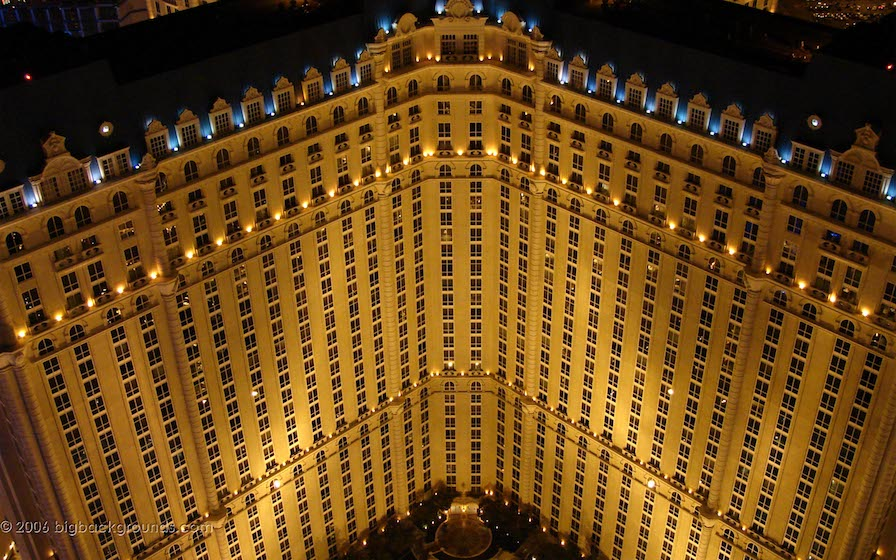
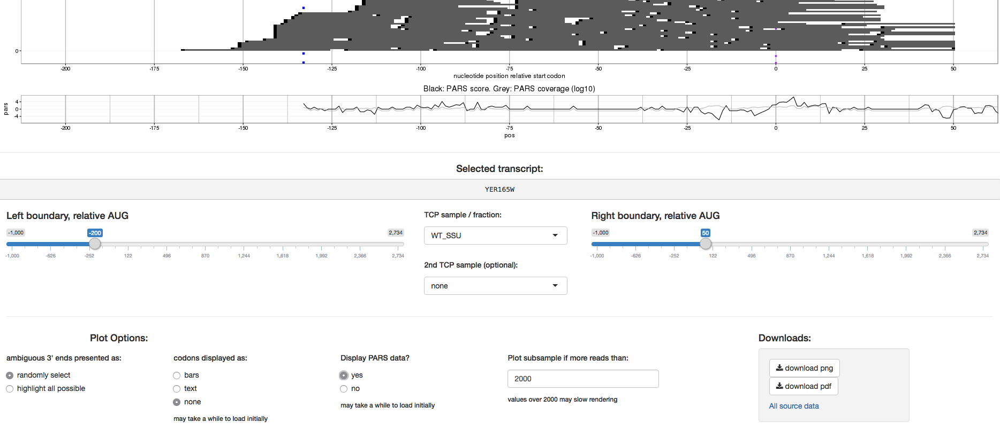

```{r setup, include=FALSE}
knitr::opts_chunk$set(echo = FALSE)
```

<div class="footer">Steve Androulakis, Monash Bioinformatics Platform (slides: steveandroulakis.github.io/goblet-clouds)</div>

# The Problem: Physical Limits & Need for Automation = Complex Compute Interfaces
```{r The Problem}
```

## Contents

I'll show you..

- What is the cloud? What for?
- Solution case studies.

```{r, out.width = "600px"}

```

## The Cloud: A Metaphor

<div class="columns-2">
<div align="center">

**Serviced Apartments..**

```{r, out.width = "400px"}

```

</div>
<br/><br/>

- You can't afford the entire building.
- You don't NEED the whole building.
- But you want an apartment, and you want some control over what you do there and who visits.
- You also don't want people in the other apartments ruining your experience.
- You just need it for a few weeks. And more rooms this weekend for a party!

</div>

## The Cloud

#### Some clouds..


<div align="center">
```{r, out.width = "150px"}
knitr::include_graphics("aws.png")
knitr::include_graphics("azure.png")

knitr::include_graphics("rackspace.png")

```

</div>


#### Some common and confronting aspects of clouds..

<div class='smaller'>

- Key pairs not passwords
- Security groups
- Storage 'volumes'
- 'Object' storage

</div>

## Commercial Clouds

Pros | Cons
------------- | ----------
'Infinite' Power  | Often Expensive
On-Demand  | Easy to be irresponsible
Upgrades | Can get 'locked in'
Reliable | Data soverignity worries
Competition | ...
No Procurement, Ops, Space | ...

## {.flexbox .vcenter}

**Data soverignity: Microsoft Azure**

"European Union (EU) data protection law regulates the transfer of EU customer personal data to countries outside the European Economic Area (EEA).."

...

"Microsoft has invested in the operational processes necessary to meet the exacting requirements of the Model Clauses for the transfer of personal data to processors."

(https://www.microsoft.com/en-us/TrustCenter/Compliance/EU-Model-Clauses)

## Non-Commercial Clouds

Pros | Cons
------------- | ----------
Cost Effective (merit)! | Booked out
Great for long-running services | Unreliable?
On-site | ...

<br/>

**Over-all recommendation:** They're complimentary solutions. Long-running compute, eg web hosting and services is quite good on a non-commercial cloud. 'Bursty' on AWS.


# Case Studies
```{r Case Studies}
```


## {.back1}
**Genomics Virtual Lab: Bioinformatics Gateway Drug**

```{r, out.width="875px"}
knitr::include_graphics("galaxy.png")
```

## {.back2}
**Stuart's Nature Paper + App: Perfect Cloud Exemplar**

<div class='evensmaller'>Archer, S. K., Shirokikh, N. E., Beilharz, T. H. & Preiss, T. Dynamics of ribosome scanning and recycling revealed by translation complex profiling. Nature 535, 570–574 (2016). <a href="http://dx.doi.org/10.1038/nature18647">doi:10.1038/nature18647</a></div>

```{r, out.width = "700px"}

```


## {.back2}
**Stuart's Nature Paper + App: Perfect Cloud Exemplar**

<div class='evensmaller'><a href="http://bioapps.erc.monash.edu/TCP/">http://bioapps.erc.monash.edu/TCP/</a> - Amazon Web Services: Elastic Beanstalk + Elastic Container Store</div>

```{r, out.width = "950px"}

```

## {.back3}
**Monash Bioinformatics Platform's Day to Day Compute and Storage**

```{r, out.width="700px"}

```

## Summary and Thanks

*Positives:* Cloud computing can help you 'get on with it' by being: powerful, flexible reliable, cost effective

*Negatives:* Clouds can be confusing: security, access, business model

I've showed you some ways we've made both commercial and non-commercial clouds work for us.

<hr/><br/>

Visit us: <a href="http://monash.edu/bioinformatics">monash.edu/bioinformatics</a>

Steve.Androulakis@monash.edu